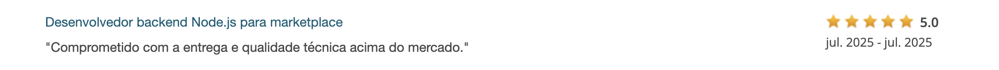

# 🕰️ Nobile Marketplace

Marketplace de relógios de luxo entre usuários. A plataforma permite que pessoas anunciem, comprem e gerenciem pedidos de relógios de alto padrão, com total segurança e integração com Stripe para pagamentos.

  

## 📦 Funcionalidades Principais

- 🔐 Autenticação de usuários com JWT
- 🧾 CRUD de relógios (criar, visualizar, editar, deletar)
- ☁️ Upload de imagens com Multer + Cloudinary
- 💳 Pagamentos e repasses com Stripe
- 🛒 Sistema de pedidos (compra, entrega e confirmação)
- 💬 Chat direto entre usuários
- 📊 Painel de administração (em desenvolvimento)

## 🚀 Tecnologias Utilizadas

- **Back-end:** Node.js + Express
- **Banco de dados:** PostgreSQL + Prisma ORM
- **Autenticação:** JWT + Bcrypt
- **Upload de imagens:** Multer + Cloudinary
- **Pagamentos:** Stripe API
- **Outros:** dotenv, cors, nodemon, uuid

## ✅ Organização dos Endpoints

- **Auth:** /auth/register, /auth/login
- **Watches:** /watches, /watches/:id ...
- **Orders:** /orders, /order/:id ...
- **Messages:** /messages
- **Collections:** /collections
- **Admin/Relatórios:** /admin/*